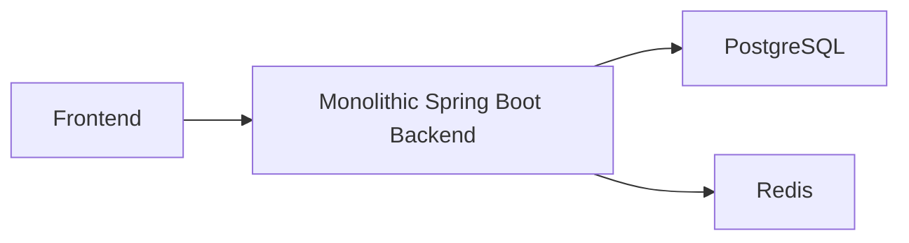
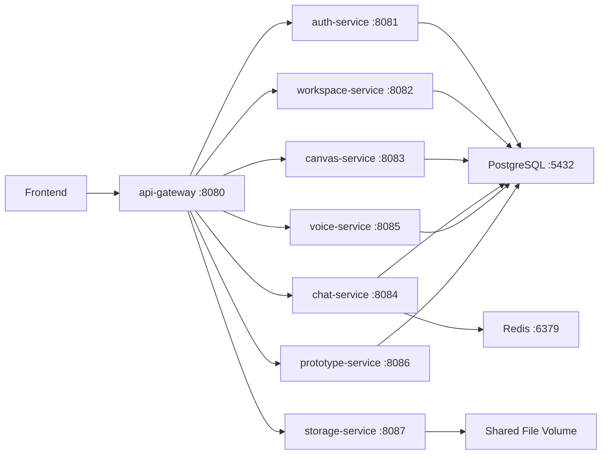
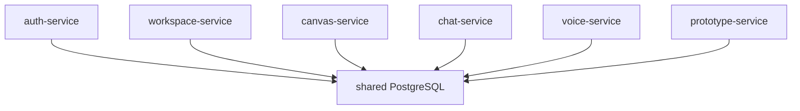
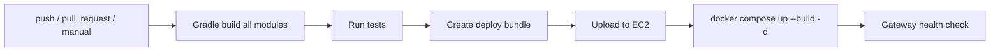

# Capstone MSA 분리 데모 자료

## 1. 한 줄 요약

기존 Capstone 백엔드는 하나의 Spring Boot 모놀리식 애플리케이션이었다. 이번 MSA 전환에서는 프론트엔드 API 계약은 그대로 유지하면서, 백엔드 기능을 도메인 기준으로 8개 서비스와 API Gateway로 분리했다.

발표용 멘트:

> 기존 프론트는 계속 `8080/api/...`만 호출하도록 유지했고, 내부 백엔드만 API Gateway 뒤에서 서비스별로 분리했습니다.

## 2. 분리 전후 구조

### 분리 전



특징:
- 하나의 Spring Boot 앱 안에 user, workspace, canvas, chat, voice, prototype, file 기능이 함께 존재
- 기능이 늘수록 컨트롤러, 서비스, 설정, 배포 단위가 모두 하나로 묶임
- 특정 기능만 수정해도 전체 백엔드를 다시 빌드/배포해야 함

### 분리 후



핵심:
- 외부 진입점은 `api-gateway:8080`
- 프론트엔드는 기존처럼 `/api/v1/...`, `/api/ws/...`를 호출
- Gateway가 요청 path를 기준으로 내부 서비스에 라우팅
- 각 서비스는 독립 포트와 독립 Docker 컨테이너로 실행

## 3. 서비스별 책임 분리

| 서비스 | 포트 | 담당 기능 |
| --- | ---: | --- |
| `api-gateway` | 8080 | 프론트 단일 진입점, CORS, path routing, WebSocket routing |
| `auth-service` | 8081 | user, Google OAuth, Apple OAuth, JWT, 로컬 개발자 로그인 |
| `workspace-service` | 8082 | workspace, workspace_user, invite, invitation |
| `canvas-service` | 8083 | canvas, idea |
| `chat-service` | 8084 | chat_message, STOMP WebSocket chat |
| `voice-service` | 8085 | voice_session, voice_session_user |
| `prototype-service` | 8086 | idea_prototype_job, PRD generation, UI generation, React generation, Vercel deployment |
| `storage-service` | 8087 | upload file, thumbnail, artifact file serving |
| `postgres` | 5432 | 기존 데이터 저장소 |
| `redis` | 6379 | WebSocket/실시간 기능 의존 인프라 |

발표용 멘트:

> 도메인 기준으로 책임을 나눴습니다. 인증은 auth-service, 워크스페이스 관리는 workspace-service, 캔버스와 아이디어는 canvas-service, 실시간 채팅은 chat-service처럼 기능별 실행 단위를 분리했습니다.

## 4. 프론트엔드 호환 유지 방식

프론트엔드 코드는 수정하지 않는 것이 목표였기 때문에, 외부 API 주소는 기존과 동일하게 유지했다.

기존 프론트 호출 예:

```text
GET  /api/v1/workspaces
POST /api/v1/auth-google
GET  /api/v1/ideas/{ideaId}
GET  /api/ws
```

MSA 전환 후에도 프론트는 그대로 `http://localhost:8080/api/...`를 호출한다. 내부에서는 API Gateway가 다음처럼 라우팅한다.

| 프론트 요청 path | 내부 라우팅 대상 |
| --- | --- |
| `/api/v1/auth-google/**` | `auth-service:8081` |
| `/api/v1/auth-apple/**` | `auth-service:8081` |
| `/api/v1/auth/dev/**` | `auth-service:8081` |
| `/api/v1/users/**` | `auth-service:8081` |
| `/api/v1/workspaces/**` | `workspace-service:8082` |
| `/api/v1/*/canvas`, `/api/v1/canvas/**` | `canvas-service:8083` |
| `/api/v1/ideas/**` | `canvas-service:8083` |
| `/api/v1/chat/**` | `chat-service:8084` |
| `/api/ws/**` | `chat-service:8084` |
| `/api/v1/workspaces/*/voice/**` | `voice-service:8085` |
| `/api/v1/ideas/*/prototype/**` | `prototype-service:8086` |
| `/api/v1/workspaces/*/prds/**` | `prototype-service:8086` |
| `/api/uploads/**`, `/uploads/**` | `storage-service:8087` |

API Gateway에서 CORS도 기존 프론트 주소를 받을 수 있게 유지했다.

```yaml
allowed-origin-patterns:
  - http://localhost:*
  - http://127.0.0.1:*
  - https://on-it.kro.kr
```

발표용 멘트:

> 프론트 입장에서는 여전히 Gateway 하나만 바라봅니다. 그래서 프론트 코드를 수정하지 않고도 내부 백엔드 구조만 MSA로 바뀌었습니다.

## 5. Spring Boot 모듈 분리 방식

프로젝트는 Gradle multi-module 구조로 구성했다.

```text
capstone_msa
├── api-gateway
└── services
    ├── auth-service
    ├── workspace-service
    ├── canvas-service
    ├── chat-service
    ├── voice-service
    ├── prototype-service
    └── storage-service
```

`settings.gradle`에서 각 서비스를 독립 모듈로 등록했다.

```gradle
include 'api-gateway'
include 'services:auth-service'
include 'services:workspace-service'
include 'services:canvas-service'
include 'services:chat-service'
include 'services:voice-service'
include 'services:prototype-service'
include 'services:storage-service'
```

각 서비스는 같은 원본 도메인 코드를 기반으로 하되, `CapstoneApplication`에서 `@ComponentScan` exclude filter를 사용해 자신이 담당하지 않는 컨트롤러/서비스가 뜨지 않게 제한했다.

예:

```java
@ComponentScan(
    basePackages = "com.capstone",
    excludeFilters = @ComponentScan.Filter(
        type = FilterType.REGEX,
        pattern = {
            "com\\.capstone\\.domain\\.(workspace|canvas|idea|chat|voicesession)\\..*"
        }
    )
)
```

이렇게 한 이유:
- 기존 코드를 최대한 유지하면서 빠르게 MSA 실행 단위로 분리
- 서비스별 controller 노출 범위를 제한
- JPA entity/repository는 공통으로 스캔해 기존 DB 구조와 호환
- 단계적으로 코드 중복 제거와 공통 모듈화를 진행할 수 있는 구조 확보

발표용 멘트:

> 처음부터 모든 도메인 코드를 완전히 새 패키지로 뜯어내기보다, 기존 동작을 보존하는 것을 우선했습니다. 그래서 서비스별 실행 모듈을 만들고 ComponentScan 범위를 제한해서 담당 API만 노출되도록 했습니다.

## 6. 데이터베이스와 파일 저장소

현재 데모 구조에서는 기존 기능 호환을 위해 PostgreSQL은 공유 DB로 유지했다.



공유 DB를 유지한 이유:
- 기존 ERD와 JPA 연관관계를 유지해야 함
- 프론트와 기존 기능 동작을 우선 보장해야 함
- MSA 데모 단계에서는 실행 단위 분리가 목표

추후 개선 방향:
- 서비스별 schema 분리
- 서비스 간 직접 DB 참조 제거
- 내부 API 또는 event 기반 통신으로 전환
- 공통 domain/entity 의존성 축소

파일 저장은 Docker volume인 `capstone-files`로 공유한다.

```yaml
volumes:
  - capstone-files:/var/lib/capstone
```

## 7. WebSocket 채팅 분리

채팅은 `chat-service`로 분리했고, Gateway에서 WebSocket path를 별도로 라우팅한다.

```yaml
- id: chat-websocket
  uri: ws://chat-service:8084
  predicates:
    - Path=/api/ws/**
    - Header=Upgrade, websocket
```

HTTP SockJS 요청도 같은 chat-service로 전달한다.

```yaml
- id: chat-sockjs-http
  uri: http://chat-service:8084
  predicates:
    - Path=/api/ws/**
```

발표용 멘트:

> WebSocket은 일반 HTTP와 다르게 Upgrade 헤더가 있어서 Gateway 라우팅을 따로 잡았습니다. 프론트는 기존 `/api/ws`를 그대로 쓰고, 내부적으로는 chat-service로 연결됩니다.

## 8. 로컬 실행 및 데모 방법

전체 MSA 실행:

```bash
./scripts/run-msa.sh
```

내부 동작:
1. 모든 서비스 JAR 빌드
2. Docker Compose로 PostgreSQL, Redis, Gateway, 7개 서비스 실행
3. Gateway는 `8080`으로 노출

상태 확인:

```bash
docker compose ps
curl http://localhost:8080/api/v1/health
```

종료:

```bash
./scripts/stop-msa.sh
```

로컬 개발자 로그인:
- 로컬 실행 스크립트는 `APP_DEV_BOOTSTRAP_AUTH=true`를 기본 적용
- 기존 Google OAuth 로그인 흐름을 타도 로컬에서는 `local-dev` code로 개발자 JWT 발급 가능
- 프론트 수정 없이 로그인 데모 가능

발표용 멘트:

> 데모에서는 Docker Compose 한 번으로 전체 MSA가 뜹니다. `docker compose ps`를 보면 Gateway와 각 도메인 서비스가 서로 다른 컨테이너, 서로 다른 포트로 실행되는 것을 확인할 수 있습니다.

## 9. CI/CD 구성

GitHub Actions workflow도 MSA 구조에 맞게 구성했다.



배포 번들에 포함되는 것:
- `Dockerfile`
- `docker-compose.yml`
- `scripts`
- `api-gateway` JAR
- 각 `services/*` JAR

EC2에서는 다음 방식으로 재배포한다.

```bash
docker compose down
docker compose up --build -d
```

헬스체크:

```text
http://<AWS_SERVER_HOST>:8080/api/v1/health
```

발표용 멘트:

> 기존 단일 JAR 배포 방식에서 MSA 배포 방식으로 바꿨습니다. 이제 CI/CD는 모든 서비스 JAR을 묶어서 EC2에 올리고, Docker Compose로 전체 스택을 다시 띄웁니다.

## 10. 데모에서 보여주면 좋은 순서

### 1단계: 프로젝트 구조

보여줄 것:

```bash
tree -L 3
```

강조:
- `api-gateway`
- `services/auth-service`
- `services/workspace-service`
- `services/canvas-service`
- `services/chat-service`
- `services/voice-service`
- `services/prototype-service`
- `services/storage-service`

### 2단계: Gateway 라우팅

보여줄 파일:

```text
api-gateway/src/main/resources/application.yml
```

강조:
- path 기반 라우팅
- CORS 유지
- WebSocket 라우팅

### 3단계: Docker Compose

보여줄 파일:

```text
docker-compose.yml
```

강조:
- 포트 분리
- 컨테이너 분리
- PostgreSQL/Redis 포함
- 서비스별 환경 변수

### 4단계: 실행 상태

보여줄 명령:

```bash
./scripts/run-msa.sh
docker compose ps
curl http://localhost:8080/api/v1/health
```

강조:
- Gateway는 8080
- 내부 서비스는 8081-8087
- 프론트는 여전히 8080만 호출

### 5단계: CI/CD

보여줄 파일:

```text
.github/workflows/ci-cd.yml
```

강조:
- 모든 모듈 빌드
- 배포 번들 생성
- EC2 업로드
- Docker Compose 재기동
- Gateway health check

## 11. 발표용 핵심 키워드

- Monolith to MSA
- API Gateway
- Frontend contract preserved
- Path-based routing
- Domain-based service split
- Docker Compose orchestration
- Shared PostgreSQL for compatibility
- WebSocket routing to chat-service
- CI/CD deploy bundle
- EC2 Docker Compose deployment

## 12. 마무리 멘트

> 이번 전환의 핵심은 기존 기능을 깨지 않고, 프론트엔드 계약을 유지한 채 백엔드 실행 단위를 도메인별로 나눈 것입니다. 현재는 공유 DB 기반의 1차 MSA 구조이고, 이후에는 서비스별 DB/schema 분리와 내부 API/event 통신으로 더 독립적인 구조로 발전시킬 수 있습니다.
