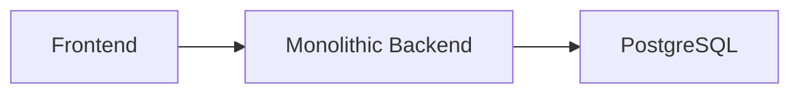
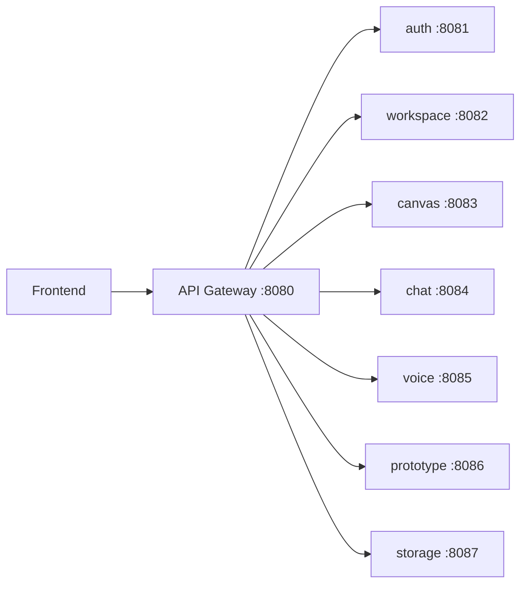
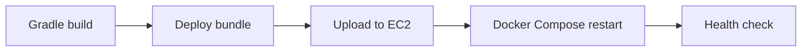

# MSA 데모 슬라이드 구성안

## 1. 목표

제목: 모놀리식 백엔드에서 MSA 구조로 전환

핵심 메시지:
- 기존 프론트엔드 코드는 수정하지 않음
- 백엔드만 도메인 기준으로 서비스 분리
- API Gateway를 통해 기존 `/api/...` 계약 유지

## 2. 기존 구조



설명:
- 하나의 Spring Boot 앱에 모든 기능 포함
- 인증, 워크스페이스, 캔버스, 채팅, 음성, 프로토타입, 파일 기능이 한 배포 단위

## 3. 전환 후 구조



설명:
- Gateway가 단일 진입점
- 내부 서비스는 기능별 컨테이너로 분리
- 프론트는 계속 `8080`만 호출

## 4. 서비스 분리 기준

| 서비스 | 담당 |
| --- | --- |
| auth-service | user, OAuth, JWT |
| workspace-service | workspace, member, invite |
| canvas-service | canvas, idea |
| chat-service | chat message, WebSocket |
| voice-service | voice session |
| prototype-service | PRD/UI/React/Vercel |
| storage-service | upload, thumbnail, artifact |

## 5. Gateway 라우팅

예시:

```text
/api/v1/auth-google/**       -> auth-service
/api/v1/workspaces/**        -> workspace-service
/api/v1/ideas/**             -> canvas-service
/api/v1/chat/**              -> chat-service
/api/ws/**                   -> chat-service
/api/v1/*/prototype/**       -> prototype-service
/api/uploads/**              -> storage-service
```

강조:
- 프론트 API path는 그대로 유지
- CORS도 Gateway에서 통합 처리

## 6. 코드 분리 방식

핵심:
- Gradle multi-module 구성
- 서비스별 Spring Boot application 생성
- `@ComponentScan` exclude filter로 담당하지 않는 도메인 제외
- 기존 DB/JPA 호환을 위해 entity/repository scan 유지

발표 멘트:

> 기존 동작 보존을 우선해서, 코드를 무리하게 새로 작성하지 않고 실행 단위부터 서비스별로 분리했습니다.

## 7. 실행 방식

명령:

```bash
./scripts/run-msa.sh
docker compose ps
curl http://localhost:8080/api/v1/health
```

보여줄 포인트:
- gateway, auth, workspace, canvas, chat, voice, prototype, storage 컨테이너가 분리 실행
- PostgreSQL, Redis도 함께 실행

## 8. CI/CD

흐름:



설명:
- 기존 단일 JAR 배포에서 MSA bundle 배포로 변경
- EC2에서 `docker compose up --build -d`

## 9. 데모 체크리스트

1. 프로젝트 구조 보여주기
2. Gateway 라우팅 설정 보여주기
3. Docker Compose 포트/서비스 분리 보여주기
4. `./scripts/run-msa.sh` 실행
5. `docker compose ps`로 컨테이너 확인
6. `curl /api/v1/health` 확인
7. 프론트가 기존 API로 동작하는 점 설명
8. GitHub Actions workflow 설명

## 10. 마무리

결론:
- 프론트 계약 유지
- 백엔드 도메인별 실행 단위 분리
- Docker Compose 기반 로컬/EC2 실행 가능
- CI/CD도 MSA 배포 방식으로 전환

향후 개선:
- 서비스별 DB/schema 분리
- 내부 API 또는 event 기반 통신
- 공통 코드 모듈화
